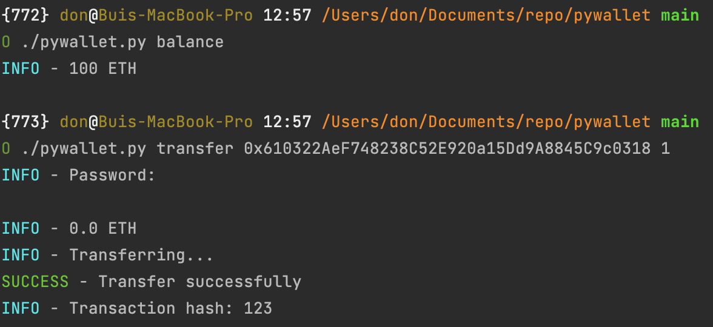

# Python Wallet - PyWallet

[](https://github.com/bxdoan/pywallet/actions/workflows/main.yml/badge.svg)


PyWallet is python script encrypt your private key. Unlike normal extension wallet, PyWallet can't connect to browser, 
so it can't be hack

(This is a re-write of the original version of PyWallet which is no longer update, still available [here](https://github.com/bui-duc-huy/tartarus-wallet).)



## Set up
1. Install package
```sh
pip3 install -r requirements.txt

```
or using pipenv
```sh
pipenv sync
```

2. Execute mod for wallet.py
```sh
chmod 777 ./pywallet.py
```

## Usage
1. Run app
```sh
./pywallet.py
```
NOTE:
By default, we use RPC from infura service to get balance and transaction. If you want to use your own node, you
can change config file
```shell
config set --url "https://mainnet.infura.io/v3/your_api_key" --keypair-file "path/to/your/keypair/file"
```

If you not have wallet, it will create new wallet and save to file *.json by command
```sh
./pywallet.py create
```
You can change url and keypair_path for your own config in `~/.pywallet/config.json` and view your wallet 
keypair in `~/.pywallet/wallet/id.json`

2. Get wallet address
```sh
./pywallet.py address
```

3. Transfer Token
```sh
./pywallet.py transfer <reicever> <amount>

./pywallet.py transfer <reicever> <amount> -t <token_address>
```

4. Get balance
```sh
./pywallet.py balance
```

## Test 
1. Run test 
```sh 
pytest -s
```

or 
```sh
./quicktest.sh
```

## TODO
1. Support tornado cash
2. Refactor code

## Thanks for use
Donate ♥ to support me
